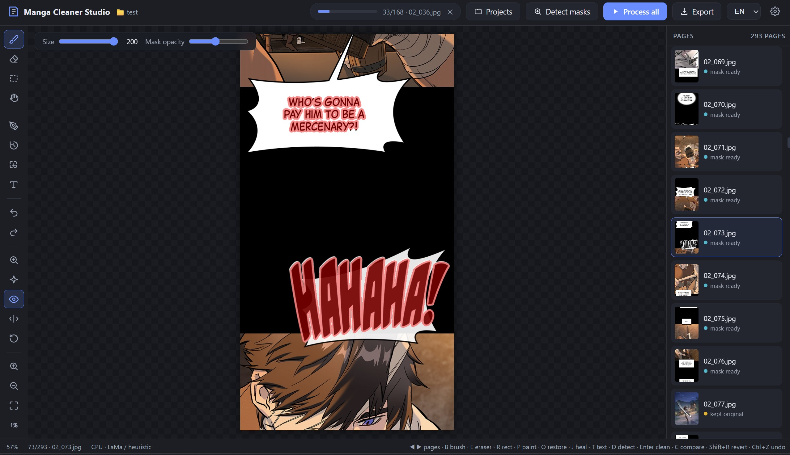
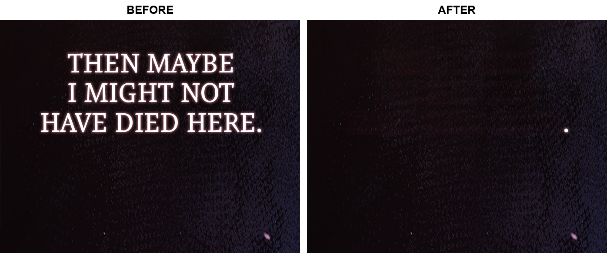

# Manga Cleaner Studio

Remove text from manga / manhwa pages — speech-balloon dialogue, SFX, captions —
and restore the artwork underneath (screentones, lines, colors).
Automatic detection + inpainting with a full **Photoshop-style manual
touch-up workflow**. Everything runs **locally**: nothing is ever uploaded.



*Studio view during a real project: mask review with red overlay, per-page status tracking, and editing tools with shortcuts visible.*



*Real manhwa page from [`examples/`](examples) — light SFX text on a dark
starfield, fully removed with the screentone/gradient background intact.
More before/after pairs: [`sample_1`](examples/sample_1.jpg) →
[`sample_1_clean`](examples/sample_1_clean.jpg),
[`sample_2`](examples/sample_2.jpg) →
[`sample_2_clean`](examples/sample_2_clean.jpg).*

**UI languages:** English (default) · Монгол — switch at runtime from the top bar.

---

## Quick start

```bash
pip install -r requirements.txt
python run.py                       # browser app: opens http://127.0.0.1:8420
```

**Desktop app** (native window, native folder pickers — no browser needed):

```bash
pip install pywebview
python desktop.py
```

For **best inpainting quality**, add LaMa (strongly recommended):

```bash
pip install torch simple-lama-inpainting
# GPU build of torch (optional): pip install torch --index-url https://download.pytorch.org/whl/cu121
```

Optional deep-learning text detection:

```bash
pip install craft-text-detector
```

Missing backends are handled gracefully — the app tells you what is missing
and falls back to the built-in OpenCV pipeline instead of crashing.

## The Studio workflow

Work is organized into **projects**: name a chapter and everything — masks,
results, typeset text, and the page you were on — is stored under
`Documents/MangaCleanerStudio/<name>/` and restored when you reopen it.

1. **Create / open a project** — name it and point it at a chapter folder
   (or drag-and-drop files; they are copied into the project). Pages sort
   naturally (`page2` < `page10`). The projects list shows everything you've
   worked on — one click continues exactly where you left off.
2. **Detect masks** — masks are generated for the whole chapter *without*
   inpainting, so you review what will be removed (red overlay) before
   anything is touched. Detection covers dark text on light backgrounds,
   **light text on dark backgrounds**, white balloons, dark balloons /
   caption boxes — and ignores plain filled shapes (circles, boxes, art
   blobs) via stroke-width analysis.
3. **Review & fix masks** — flip through pages with the **◀ ▶ arrow keys**
   (ignored mid-stroke and inside dialogs — you can't fall off a page by
   accident). Every edit is **auto-saved when you switch pages** and restored
   when you come back; your masks are never overwritten by re-detection.
4. **Process all** — every page is inpainted using its reviewed mask;
   live progress, per-page status dots, a failing page never stops the batch.
5. **Repair & typeset** (per page):
   * **Mask tools** — brush `B` / eraser `E` / rectangle `R`; red overlay
     with opacity control; right-click erases
   * **Paint `P`** — draw directly on the page; **Alt+click picks a color**
     from the artwork (eyedropper)
   * **Restore `O`** — brush the *original* pixels back wherever inpainting
     damaged the art
   * **Spot heal `J`** — paint over a flaw and it is re-inpainted instantly
   * **Text `T`** — double-click to place a translation where the original
     text was: font / size / color / outline, drag to move, `Del` deletes;
     stored per page and **burned into the exported files**
   * **Undo / redo across mask, paint, and text edits** (Ctrl+Z / Ctrl+Y)
6. **Export** — original filenames into the project's `output/` folder (or
   any folder you pick), translations rendered in, plus a ZIP download.

### Keyboard shortcuts

| Key | Action | Key | Action |
|---|---|---|---|
| `◀` `▶` (or `,` `.`) | previous / next page | `D` | auto-detect page |
| `B` / `E` / `R` / `H` | brush / eraser / rect / pan | `Enter` | clean page |
| `P` / `O` / `J` / `T` | paint / restore / heal / text | `M` | toggle mask |
| `C` (hold) | compare with original | `Shift+R` | revert to original |
| `Ctrl+Z` / `Ctrl+Y` | undo / redo | `[` / `]` | brush size |
| `Alt+click` | eyedropper (paint tool) | `+` `−` `0` `1` | zoom / fit / 100% |

## CLI (automation / scripting)

```bash
python main.py --input page.png                       # single page
python main.py --input chapter/ --batch --output out/ # whole folder
python main.py --input page.png --model opencv        # CPU-fast fallback
python main.py --input page.png --mask-only           # export mask for hand editing
python main.py --input page.png --mask page_mask.png  # clean with a hand-made mask
```

Run `python main.py --help` for all options (`--detect balloon|sfx|both`,
`--dilate`, `--feather`, `--device`, …). Installed as a package it is also
available as the `manga-cleaner` command.

## Project structure

```
manga-text-cleaner/
├── run.py                     # Studio launcher (browser)
├── desktop.py                 # Studio launcher (native window, pywebview)
├── main.py                    # CLI entry point
├── pyproject.toml             # package metadata (pip install -e .)
├── requirements.txt
├── mangacleaner/
│   ├── cli.py                 # command-line interface
│   ├── core/                  # UI-agnostic image pipeline
│   │   ├── io_utils.py        #   unicode/webp-safe read & write
│   │   ├── detection.py       #   OpenCV heuristics + CRAFT backend
│   │   ├── inpainting.py      #   LaMa (simple-lama / IOPaint) + Telea fallback
│   │   ├── postprocess.py     #   dilate, feather, white-balloon preservation
│   │   ├── typeset.py         #   render translations onto exported pages
│   │   └── pipeline.py        #   cached models, thread-safe entry points
│   └── server/
│       ├── app.py             # FastAPI REST API
│       ├── project.py         # named projects (persistence), batch job, export
│       └── static/            # SPA: index.html, app.js, editor.js, i18n.js, style.css
├── tests/
│   ├── test_api.py            # end-to-end API tests (projects, batch, export)
│   └── test_detection.py      # detector unit tests
└── examples/                  # real manga/manhwa pages + before/after output
```

## How it works

detection → mask refinement → inpainting → post-processing:

1. **Detect** — CRAFT (if installed) or built-in heuristics: balloons are
   large convex white regions (dark pixels inside = text); SFX are clustered
   letter-shaped dark components outside balloons.
2. **Refine** — morphological dilation so no text edge survives, then the
   mask is handed to the editor for optional manual correction.
3. **Inpaint** — LaMa (GPU/CPU) or OpenCV Telea.
4. **Post-process** — near-white surroundings are flood-filled flat white
   (balloons stay pure white, never gray); mask edges are feathered;
   **pixels outside the mask are never modified**.

## Testing

```bash
python tests/test_detection.py   # detector unit tests (dark/light text, shapes, blanks)
python tests/test_api.py         # end-to-end API suite (projects, batch, export)
```

## Known limitations

- The heuristic SFX detector can miss stylized SFX drawn over dense art —
  that is exactly what the manual brush workflow is for.
- OpenCV Telea inpainting smears screentones; install LaMa for quality.
- Very long webtoon strips work but are processed unscaled — LaMa on CPU can
  be slow for 10k-pixel-tall images (tiled inpainting is on the roadmap).